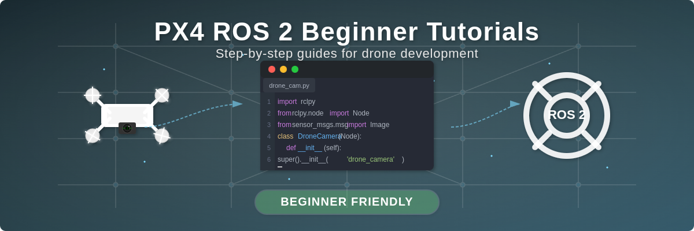

# PX4 ROS 2 Beginner Tutorials

A step-by-step guide to getting started with PX4, ROS 2, and Gazebo for drone development.



> 🚧 **Work in Progress**: This tutorial series is under active development. Currently, only the Camera Bridge tutorial is available. More tutorials will be added soon!

## 📚 What You'll Learn

This repository contains beginner-friendly tutorials for working with PX4, ROS 2, and Gazebo. Whether you're a student, hobbyist, or professional, these guides will help you build a strong foundation for drone development.

## 🗺️ Tutorial Roadmap

Here's what we're planning to cover in this series:

### Available Now
- ✅ [**Camera Feed Bridge**](camera-bridge/) - Learn how to bridge camera feeds from Gazebo to ROS 2 in PX4 simulations

### Coming Soon
- ⏳ Environment Setup - Ubuntu, ROS 2, PX4, and Gazebo installation
- ⏳ First Steps with ROS 2 - Workspaces, packages, and basic concepts
- ⏳ PX4 Simulation Basics - Running your first drone simulation
- ⏳ ROS 2 & PX4 Communication - Connecting ROS 2 to your simulated drone
- ⏳ Basic Drone Control - Simple commands for flight control
- ⏳ First Autonomous Functions - Creating basic autonomous behaviors

## 🎓 Who Is This For?

These tutorials are designed for:
- Beginners to PX4 and ROS 2
- Students working on drone projects
- Hobbyists exploring autonomous systems
- Professionals transitioning to drone development
- Anyone interested in learning drone programming step-by-step

No prior experience with drones is required, but basic knowledge of Linux commands and programming concepts will be helpful.

## 🚀 Getting Started

### Prerequisites

To follow these tutorials, you'll need:
- Ubuntu 22.04 LTS
- ROS 2 Humble
- PX4-Autopilot (latest version)
- Gazebo Garden/Harmonic
- Basic knowledge of Linux terminal commands
- Basic understanding of Python programming

### How to use this Repository

1. Clone this repository:
   ```bash
   git clone https://github.com/sidharthmohannair/px4-ros2-beginner-tutorials.git
   cd px4-ros2-beginner-tutorials
   ```

2. Navigate to a specific tutorial folder:
   ```bash
   cd camera-bridge
   ```

3. Follow the instructions in the tutorial's README.md file

## 📸 Featured Tutorial: Camera Feed Bridge

Learn how to bridge camera feeds from a PX4 simulation in Gazebo to ROS 2, enabling you to process camera data using ROS tools and libraries.


This tutorial covers:
- Setting up a camera-equipped drone in simulation
- Identifying camera topics in Gazebo
- Bridging the camera feed to ROS 2
- Visualizing and processing the camera data

[Go to Camera Bridge Tutorial →](/tutorials/camera-bridge/README.md)

## 📝 Feedback & Contributions

Your feedback helps improve these tutorials for everyone!

- Found a typo or error? Please open an issue.
- Have a suggestion for improvement? Submit a pull request.
- Want to request a specific tutorial? Let us know in the discussions.

## 📞 Stay Updated

Star and watch this repository to be notified when new tutorials are added!

## 📜 License

This project is licensed under the MIT License - see the [LICENSE](/LICENSE) file for details.

---

Happy coding and happy flying! 🚁✨